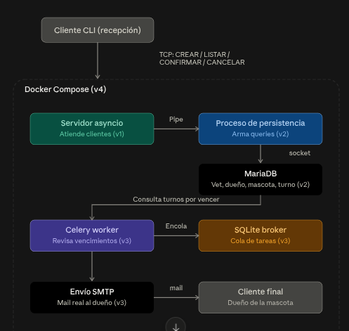

# Turnos Vet

Sistema de gestión de turnos para veterinarias — proyecto final de
Computación II.

**Alumno:** Alexis Martin Yassuff
**Legajo:** 62072

## Qué es

Un servidor de turnos al que se conectan clientes CLI por TCP (IPv4/IPv6).
Se entrega en versiones incrementales, cada una suma una tecnología nueva
sin romper la anterior: sockets async → base de datos relacional →
tareas en background → contenedores.

## Arquitectura



- **Cliente CLI**: REPL que habla el protocolo por TCP (`CREAR`,
  `LISTAR`, `CONFIRMAR`, `CANCELAR`).
- **Servidor asyncio** (v1): dual-stack IPv4/IPv6, sin estado propio —
  delega toda la persistencia.
- **Proceso de persistencia** (v2): subproceso Python separado que arma
  las queries SQL y habla con el servidor por pipe (stdin/stdout).
- **MariaDB** (v2): guarda veterinarios, dueños, mascotas y turnos.
- **Celery worker + broker SQLite** (v3): revisa periódicamente turnos
  próximos a vencer o sin confirmar.
- **Envío de mail** (v3): notifica al dueño por SMTP.
- **Docker Compose** (v4): orquesta servidor, MariaDB y broker en
  contenedores separados.

## Modelo de datos (desde v2)

```
veterinarios(id_veterinario, nombre)
duenos(id_dueno, nombre)
mascotas(id_mascota, id_dueno -> duenos, nombre)      UNIQUE(id_dueno, nombre)
turnos(id_turno, id_veterinario -> veterinarios,
       id_mascota -> mascotas, fecha, hora, estado)   UNIQUE(id_veterinario, fecha, hora)
```

`turnos` no guarda `id_dueno` propio: se obtiene vía `mascota.id_dueno`
para evitar inconsistencias si una mascota cambia de dueño. El
`UNIQUE(id_veterinario, fecha, hora)` es la validación de superposición
de horarios, aplicada como constraint de la base en vez de chequeo manual.

Las entidades (vet/dueño/mascota) se resuelven por nombre con
**get-or-create**: el cliente sigue mandando texto plano y la
persistencia busca o crea el registro correspondiente.

## Funciones clave por capa

**Servidor** (`server/server.py`)
- Dos `asyncio.start_server` en paralelo (IPv4 + IPv6) vía `asyncio.gather`.
- Lanza y supervisa el subproceso de persistencia
  (`asyncio.create_subprocess_exec`).
- `lock_persistencia`: serializa el acceso al pipe, una operación de DB
  en vuelo por vez.
- Traduce comandos de red (`CREAR|...`) a comandos internos (`DB_CREAR_TURNO|...`)
  y devuelve la respuesta casi sin tocar.

**Persistencia** (`server/persistencia.py`)
- Loop síncrono sobre stdin/stdout, único proceso que arma SQL.
- Conexión a MariaDB por socket con PyMySQL (`autocommit=True`).
- Crea el esquema (`CREATE TABLE IF NOT EXISTS`) al arrancar, sin setup manual.

**Cliente** (`client/client.py`)
- Conexión persistente (`asyncio.open_connection`), REPL con múltiples
  comandos por sesión.
- Parseo de subcomandos con `ArgumentParser` que no mata el proceso ante
  un error de sintaxis.

## Protocolo

Texto plano, un comando por línea, `COMANDO|arg1|arg2|...`.

| Comando | Respuesta |
|---|---|
| `CREAR\|vet\|dueño\|mascota\|fecha\|hora` | `OK\|<id>` |
| `LISTAR` | `OK\|LISTAR\|<n>` + n líneas |
| `CONFIRMAR\|<id>` | `OK` |
| `CANCELAR\|<id>` | `OK` |
| `SALIR` | cierra la conexión |

Errores: `ERROR|<motivo legible>` en cualquier comando.

## Estado del proyecto

- ✅ **v1** — servidor/cliente asyncio, estado en memoria.
- ✅ **v2** — MariaDB, modelado relacional, proceso de persistencia por pipe.
- ⏳ **v3** — Celery + SQLite como broker, alertas de turnos por vencer.
- ⏳ **v4** — Docker Compose (servidor + MariaDB + broker).
- ⏳ **v5+** — historial clínico, roles, features adicionales.

## Cómo correrlo

```bash
pip install -r requirements.txt
python server/server.py        # levanta persistencia + sockets IPv4/IPv6
python client/client.py        # REPL de cliente
```

Config de DB por variables de entorno (`TURNOS_DB_HOST`, `TURNOS_DB_PORT`,
`TURNOS_DB_USER`, `TURNOS_DB_PASSWORD`, `TURNOS_DB_NAME`) o flags
equivalentes en `server.py`. Default: MariaDB local sin password.
